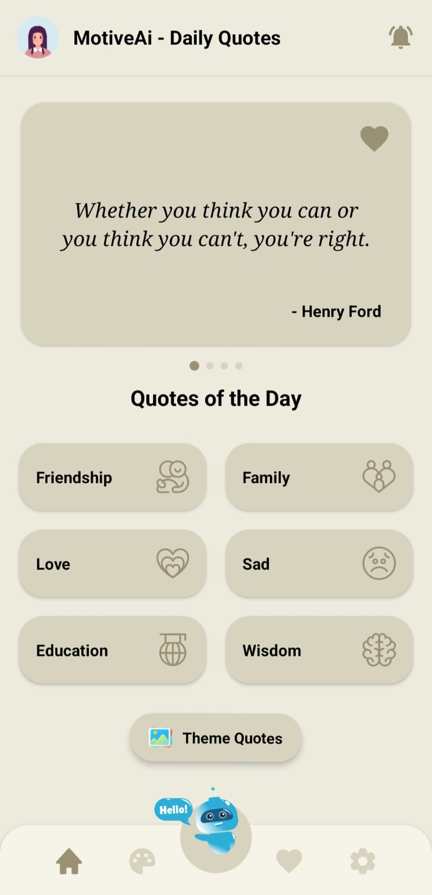
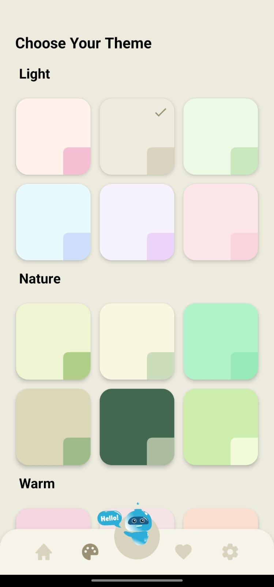
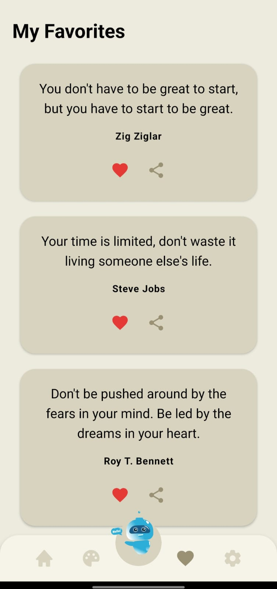
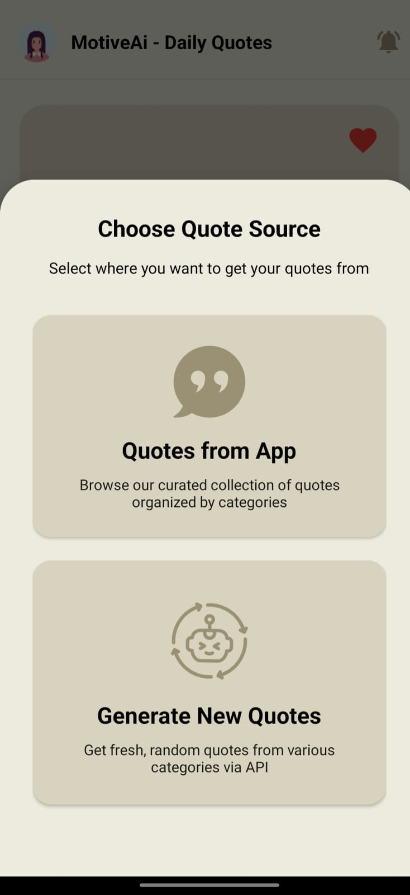
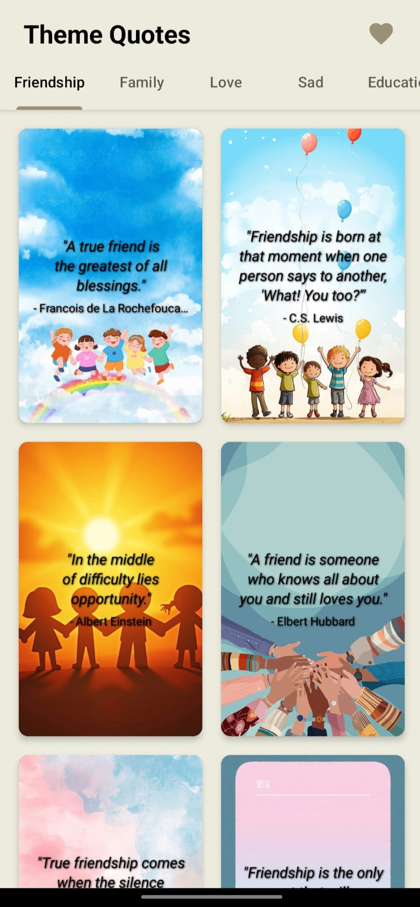

# MotiveAI – Daily Quotes

<p align="center">
  <a href="https://play.google.com/store/apps/details?id=com.motiveai.dailyquotes">
    
  </a>
  
  
  
</p>

---

**MotiveAI** is a fully published Android app that delivers daily motivational quotes across multiple categories. It combines **offline SQLite storage** with **real-time API-fetched quotes**, offering a smooth and personalized experience with theme customization, favorites, reminders, and sharing features.

---

## 📸 Screenshots

<p align="center">
  
  &nbsp;
  
  &nbsp;
  
  &nbsp;
  
  &nbsp;
  
</p>

---

## 🎬 Demo

▶️ [Watch the 1m 18s Demo on YouTube](https://youtu.be/-9s4gp_rb5I)

---

## 🚀 Features

- 📚 Browse quotes across **multiple categories**
- 🖼️ **Background quotes** — shareable as text or image
- ❤️ **Add/remove favorites** for both offline and API-fetched quotes
- 🔔 **Set reminders** per category
- 🎨 **Theme personalization** with multiple color options
- 📤 **Share quotes** via social media or messaging apps

---

## 🛠️ Tech Stack

| Area | Technology |
|------|-----------|
| Language | Java |
| Database | SQLite (offline storage) |
| API | Free Quotes APIs (real-time fetch) |
| Architecture | Modular, clean & maintainable |
| UI/UX | Material Design with multi-theme support |

---

## 🏗️ Architecture Overview

```
MotiveAI
├── UI Layer          → Activities, Fragments, Adapters
├── Data Layer        → SQLite (offline) + Quotes API (online)
├── Features          → Categories, Favorites, Reminders, Themes
└── Utilities         → Share, Notification Scheduler, Theme Manager
```

---

## 🔮 Future Enhancements

- ⏰ Full alarm feature with day-based scheduling for repeated reminders
- 🌍 Multi-language quote support based on user preference
- 🖋️ Expanded background themes and font customization

---

## 📝 Notes

- Source code is **private** as the app is published on the Play Store
- This repository contains the **demo video and project documentation** for recruitment/portfolio purposes
- All app logic, creative features, and end-to-end implementation were done **independently**
- UI inspiration and base icons were provided by a designer

---

## 🔗 Links

- 📱 [Play Store – MotiveAI - Dialy Quotes](https://play.google.com/store/apps/details?id=com.motiveai.dailyquotes&pcampaignid=web_share)
- 🎬 [Demo Video](https://youtu.be/-9s4gp_rb5I)
